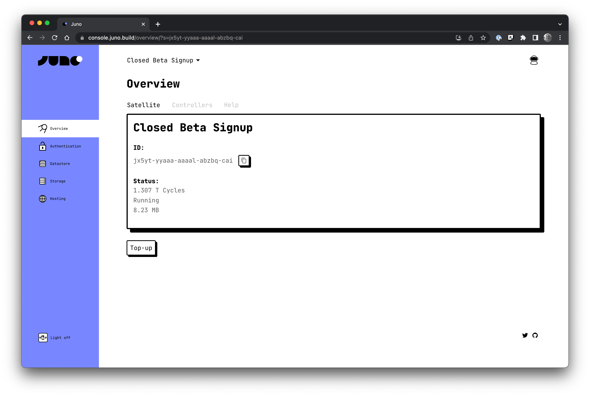
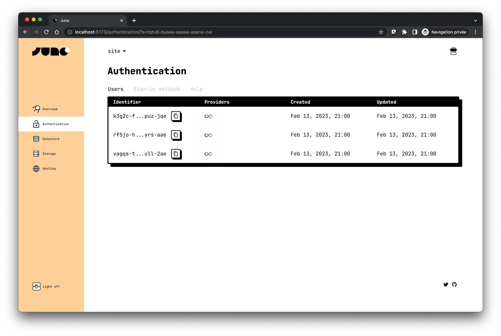
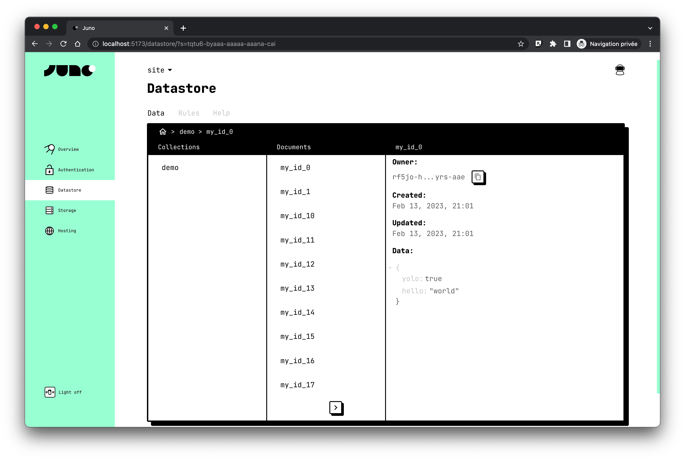
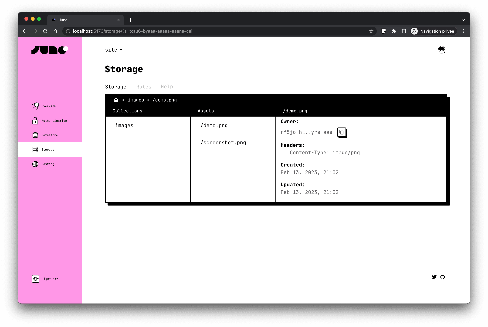

I am thrilled to introduce [Juno](https://juno.build), a groundbreaking open-source Blockchain-as-a-Service solution that makes building Web3 applications more accessible to the millions of front-end developers worldwide.



---

## What is Juno?

Unlike traditional Backend-as-a-Service (BaaS) platforms like Google Firebase or AWS Amplify, Juno runs entirely on the blockchain.

It allows you to forget about all the backend aspects of development, letting focus on what matters: the product your users see.

Our platform operates without controlling your data or work. With Juno, you truly own your creations.

The Juno closed beta program is launching today and is packed with all the essential features you need to start creating Web3 applications.

---

## How It Works

Every project you create on Juno is a "Satellite": a smart contract that you own, running 100% on-chain. 🛰️

It is a container for your application that holds all your project's state: users' persisted data, asset storage (images or video) and your application bundle.

A satellite lives on its own -- and only _you_ can administrate it, because you _own_ it, exactly like an NFT.

---

## Authentication

Juno allows developers to securely identify users anonymously and save their data on the blockchain.

Our easy-to-use SDKs support authentication via [Internet Identity](https://internetcomputer.org/internet-identity), a Web3 authentication provider that offers a secure blockchain login experience with a user-friendly Web2 interface, and more providers will be added soon.

Authentication integrates tightly with other Juno services, like [datastore](https://juno.build/docs/build/datastore) and [storage](https://juno.build/docs/build/storage):

```javascript
import { signIn } from "@junobuild/core";

const btn = document.querySelector("#signin");
btn?.addEventListener("click", signIn, { passive: true });
```



---

## Datastore

Juno Datastore can be use to add persistence to your application using simple constructs: collections and documents.

Collections specify which users and/or administrators have access to their data. Juno itself does _not_ have access to data in collections (unless you make it public, of course). Juno also gives you the possibility to design your architecture so that even _you_ (the developer of your application) can have no access to the data saved by your users.

```typescript
import { getDoc, setDoc } from "@junobuild/core";

const collection = "my_collection";
const key = "my_key";

const doc = await getDoc({
  collection,
  key,
});

await setDoc({
  collection,
  doc: {
    key,
    ...doc,
    data: {
      email: myNewEmail,
    },
  },
});
```



---

## Storage

Juno Storage is the easiest way to let your users upload and manage their files securely on the blockchain. The API we provide is designed to obfuscate any potential complexity. It takes advantage of the same read and write permission concept as the Datastore and automatically makes the file available on the Internet with the help of a built-in query parameters "token" mechanism that can be use to make users files secret.

```javascript
const input = document.querySelector("input");

const { downloadUrl } = await uploadFile({
  data: input.files[0],
  collection: "images",
});
```



---

## Hosting

Juno Hosting - like our other services - runs on the Internet Computer. It is the only blockchain with canister smart contracts that can serve web assets to browsers straight from the chain -- meaning no dependency on centralized Big Tech.

Therefore, the "Satellites" launched on Juno run entirely on blockchain, which allows for full decentralization.

Custom domain names are fully supported and easily configured, meaning your unique brand identity will be just as visible on chain.


---

## What's next?

We are starting our closed beta program today. Contact David on [Twitter](https://daviddalbusco.com) or fill this [form](https://jx5yt-yyaaa-aaaal-abzbq-cai.ic0.app/) - built with Juno 😉 - to enter the waiting list.

⭐️⭐️⭐️ are also much appreciated: visit the [GitHub repo](https://github.com/buildwithjuno/juno) and show your support!
