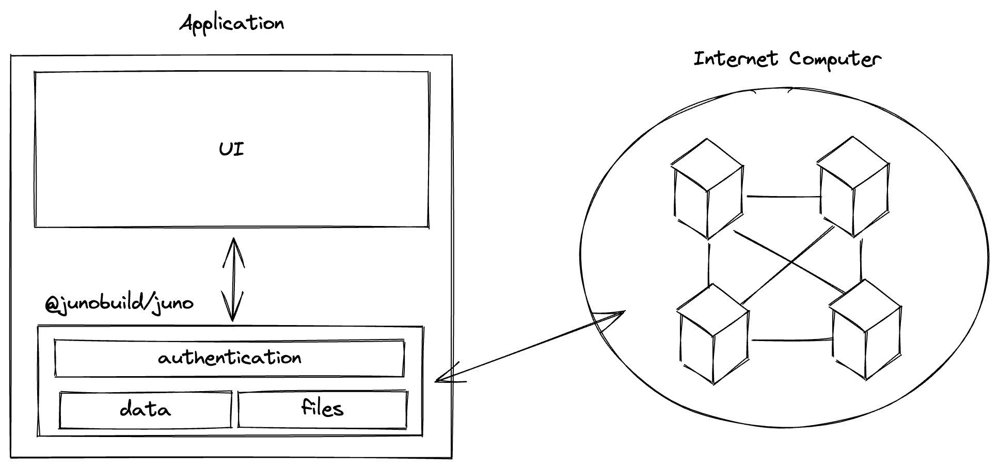
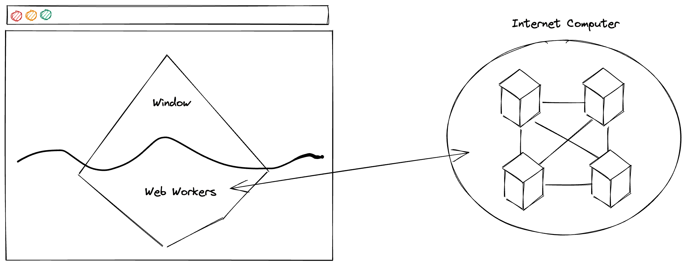

---

I developed a web-based drawing application —  [icdraw.com](https://icdraw.com/)  —  on the [Internet Computer](https://internetcomputer.org/) blockchain in just a single weekend, thanks to the smooth integration provided by [Juno](https://juno.build/) 🛰️. In this blog post, I present some insights into the architecture of the frontend application I’ve built.

---

## Architecture

From a fundamental perspective, developing a JavaScript frontend application running entirely on blockchain using Juno does not differ significantly in terms of architecture compared to traditional Web2 serverless solutions.

At the heart of the application lies a library responsible for evaluating the user’s authentication status, enabling or disabling access to different features based on this assessment. Each of these features has the capability to interact with and manipulate data and files on the blockchain, allowing for read, write, update, or delete operations. The only minor distinction is that modifying a state on the blockchain introduces a slight delay of a few seconds compared to saving data on a centralized server. This delay is due to the requirement of certifying the information through a consensus round.



While there are no significant other differences, one crucial aspect stands out: my personal aversion to using applications that necessitate “manual save.” To address this, I envisioned and implemented an auto-save feature.

However, as I understand that data persistence requires resources, I strategically incorporated this process within a Web Worker. By doing so, the burden of this task is shifted away from the UI, ensuring a seamless user experience.



Instead of implementing an approach where the UI triggers any changes by directly interacting with the worker, I opted for a different approach in this project. Upon app initialization, a cron timer is initiated within the web worker. This timer periodically checks for any changes and processes the save operation if any modifications are detected.


Due to Juno’s ability to simplify and abstract the backend complexities associated with interfacing with the Internet Computer, there are no particular architectural details of the project really worth mentioning in my opinion. However, as the application was developed using React, I can provide some insights into the code structure.

---

## Code Structure

In my development process, I generally adopt a code organization strategy based on layers rather than features. It is worth noting that this practice may not be considered a current best practice, as it probably originates from my past experience working on projects using Java with Maven, quite some time ago 😅.

In the case of this project developed with React, the code was structured as follows:


I developed the UI using several independent and reusable UI components. Rather than relying on an external state management system, I opted to utilize a few React contexts for the few information that needed to be available globally.

---

## Context

The integration process of Juno begins with a straightforward initialization at the root of the project, specifically in App.tsx , connecting the application to its associated smart contract, which we affectionately named “Satellite.” Once connected, it gains the ability to interact with the blockchain.

```typescript jsx
import { initJuno } from "@junobuild/core";
import { useEffect, useState } from "react";
import { Scene } from "./components/Scene.tsx";
import { Auth } from "./components/context/Auth.tsx";
import { Worker } from "./components/context/Worker.tsx";

const App = () => {
  const [ready, setReady] = useState(false);

  useEffect(() => {
    (async () => {
      await initJuno({
        satelliteId: "fqotu-wqaaa-aaaal-acp3a-cai",
      });

      setReady(true);
    })();
  }, []);

  return (
    <Auth>
      <Worker>
        <Scene ready={ready} />
      </Worker>
    </Auth>
  );
};

export default App;
```

In the code snippet mentioned above, you may have noticed the use of two contexts:

* Auth: Handles the loading and synchronization of the user’s authentication state.

* Worker: Manages the initialization and communication with the web workers.

---

### Authentication Context

Juno offers a convenient observable function called authSubscribe() which provides information about the user’s sign-in status. To replicate this status across the entire application, I leveraged an effect and context mechanism. This allowed me to effectively propagate the user’s sign-in status throughout the app.

```typescript jsx
import { authSubscribe, User } from "@junobuild/core";
import { createContext, ReactNode, useEffect, useState } from "react";
import { Spinner } from "../misc/Spinner.tsx";
import styles from "./Auth.module.scss";

export const AuthContext = createContext<{
  user: undefined | null | User;
  setBusy:
    | React.Dispatch<React.SetStateAction<boolean | undefined>>
    | undefined;
}>({
  user: undefined,
  setBusy: undefined,
});

export const Auth = ({ children }: { children?: ReactNode }) => {
  const [user, setUser] = useState<User | null | undefined>(undefined);
  const [busy, setBusy] = useState<boolean | undefined>(undefined);

  useEffect(() => {
    const sub = authSubscribe((user) => setUser(user));

    return () => sub();
  }, []);

  return (
    <AuthContext.Provider value={{ user, setBusy }}>
      {children}

      {busy ? (
        <div className={styles.loading}>
          <Spinner />
        </div>
      ) : undefined}
    </AuthContext.Provider>
  );
};
```

In addition to the authentication functionality, I also incorporated a “busy” indicator within the context. This indicator displays a backdrop and spinner over the content when a sign-in process is in progress. But hey, I developed the project over a weekend, so I had to make some trade-offs.

---

### Worker Context

Implementing the initialization and interaction with web workers within a context was a new experience for me, and I must say, it’s pretty cool. In fact, I might even consider writing a separate blog post about it on my personal website because it’s an intriguing topic worth exploring further.

```typescript jsx
import {
  createContext,
  ReactNode,
  useContext,
  useEffect,
  useState,
} from "react";
import {
  PostMessage,
  PostMessageDataResponse,
} from "../../types/post-message.ts";
import { AuthContext } from "./Auth.tsx";

export const WorkerContext = createContext<{
  worker: Worker | undefined;
  busy: boolean;
}>({
  worker: undefined,
  busy: false,
});

export const Worker = ({ children }: { children?: ReactNode }) => {
  const [worker, setWorker] = useState<Worker | undefined>(undefined);
  const [busy, setBusy] = useState<boolean>(false);

  const { user } = useContext(AuthContext);

  useEffect(() => {
    (async () => {
      let w: Worker | undefined = worker;

      // Lazy load Web Worker
      if (w === undefined) {
        const Worker = await import("../../workers/worker?worker");
        w = new Worker.default();

        setWorker(w);
      }

      // Start or stop cron job
      w?.postMessage({
        msg: user !== undefined && user !== null ? "start" : "stop",
        data: {
          user,
        },
      });

      // Receive messages from the worker
      if (w !== undefined) {
        w.onmessage = ({
          data,
        }: MessageEvent<PostMessage<PostMessageDataResponse>>) => {
          const { msg } = data;
          setBusy(msg === "busy");
        };
      }
    })();

    return () => worker?.postMessage({ msg: "stop" });

    // eslint-disable-next-line react-hooks/exhaustive-deps
  }, [user]);

  return (
    <WorkerContext.Provider value={{ worker, busy }}>
      {children}
    </WorkerContext.Provider>
  );
};
```

Within an effect, the user’s status passed through the previously defined context is observed. Based on whether the user is signed in or not, the worker is invoked to start or stop the cron job accordingly.

Furthermore, when the user is defined, it is passed to the worker using the postMessage method. This ensures that the worker performs its tasks only when the user is signed in too.

It’s worth noting that the web worker is lazily loaded. This approach was implemented to address bundling issues and ensure performance efficiency by loading the worker module only when necessary.

---

## IndexedDB

To save the edited data on the UI side and retrieve it in the worker before replicating it on the blockchain, I utilized IndexedDB with the assistance of one of my favorite libraries called [idb-keyval](https://github.com/jakearchibald/idb-keyval).

```typescript
import { createStore, get, setMany } from "idb-keyval";
import { Metadata } from "../types/app.ts";

const stateStore = createStore("icdraw-state", "state");

const KEY_SCENE = "scene-key";
const KEY_NAME = "scene-name";
const KEY_LAST_CHANGE = "last-change";

// Not exhaustives functions example

export const setMetadata = ({ key, name }: Metadata) =>
  setMany(
    [
      [KEY_LAST_CHANGE, Date.now()],
      [KEY_SCENE, key],
      [KEY_NAME, name],
    ],
    stateStore
  );

export const getLastChange = (): Promise<number | undefined> =>
  get(KEY_LAST_CHANGE, stateStore);
```

Using the “last change” information, the cron job timer running in the web worker can determine if data needs to be saved on the blockchain or not.

```typescript
let lastChangeProcessed: number | undefined = undefined;
    
const sync = async () => {
  const lastChange = await getLastChange();

  if (lastChange === undefined) {
    // There weren't any changes
    return;
  }

  if (lastChangeProcessed !== undefined && lastChange <= lastChangeProcessed) {
    // No new changes
    return;
  }

  // Do the job

  lastChangeProcessed = lastChange;
};
```

---

## Web Worker

As mentioned in the architecture chapter, the concept of the project is to continuously monitor for new changes rather than waiting for specific messages to trigger processes. Therefore, the worker receives only start and stop information and executes the necessary tasks accordingly.

```typescript
onmessage = async ({
  data: { msg, data },
}: MessageEvent<PostMessage<PostMessageDataRequest>>) => {
  switch (msg) {
    case "start":
      await startTimer(data?.user);
      break;
    case "stop":
      stopTimer();
      break;
  }
};

let timer: NodeJS.Timeout | undefined = undefined;

const stopTimer = () => {
  if (!timer) {
    return;
  }

  clearInterval(timer);
  timer = undefined;
};

const startTimer = async (user: User | undefined | null) => {
  if (user === null || user === undefined) {
    // We do nothing if no user
    console.error("Attempted to initiate a worker without a user.");
    return;
  }

  const execute = async () => await sync(user);

  // We start now but also schedule the update after wards
  await execute();

  timer = setInterval(execute, 1000);
};
```

On the UI side, Juno is initialized with initJuno which allow the library to automatically provide the information to authenticate each call made to the API smart contract. However, in the worker, I did not utilize this functionality. Instead, I manually constructed the necessary information required by the smart contract to validate the calls.

```typescript
const sync = async (user: User | undefined | null) => {
    
  // Some checks and logic

  const satellite = {
      identity: await unsafeIdentity(),
      satelliteId: "fqotu-wqaaa-aaaal-acp3a-cai",
  };

  const doc = await getDoc<JunoScene>({
      collection: "scenes",
      key,
      satellite,
  });
```

The function responsible for resolving the identity is named unsafeIdentity  because it returns imperative information that can include an anonymous  identity. As such, it should only be used when necessary, and its  specific name serves as a reminder to handle it with caution.

While the majority of the work was delegated to the web worker, I still wanted to visually indicate to the user when certain tasks were in progress. To achieve this, I implemented a messaging system where the worker sends messages to the UI indicating whether it is in a busy or idle state. This status information is then used to display a spinner and disable action buttons.

```typescript
// Web Worker
postMessage({
    msg: "busy", // or "idle"
});

// UI
import { SyncOutlined } from "@ant-design/icons";
import { useContext } from "react";
import { WorkerContext } from "../context/Worker.tsx";
import styles from "./Busy.module.scss";

export const Busy = () => {
  const { busy } = useContext(WorkerContext);

  return (
    <div className={styles.busy}>
      {busy ? <SyncOutlined spin /> : undefined}
    </div>
  );
};
```

Because the interaction with the worker was scoped and shared within a context, I could utilize this information in a component without the need to pass properties or reinstantiate the worker.

---

## Resources

The project I developed over the weekend, which I have described in this blog post, is open source, just like [Juno](https://juno.build)! 🤗

* icdraw 👉 [https://github.com/peterpeterparker/icdraw](https://github.com/peterpeterparker/icdraw)

* Juno 👉 [https://github.com/buildwithjuno/juno](https://github.com/buildwithjuno/juno)

---

👋

Thank you for reading! Stay connected with Juno by following us on [Twitter](https://twitter.com/junobuild) to keep up with our latest updates.

And if you made it this far, we’d love to have you join the Juno community on [Discord](https://discord.gg/wHZ57Z2RAG). 😉
