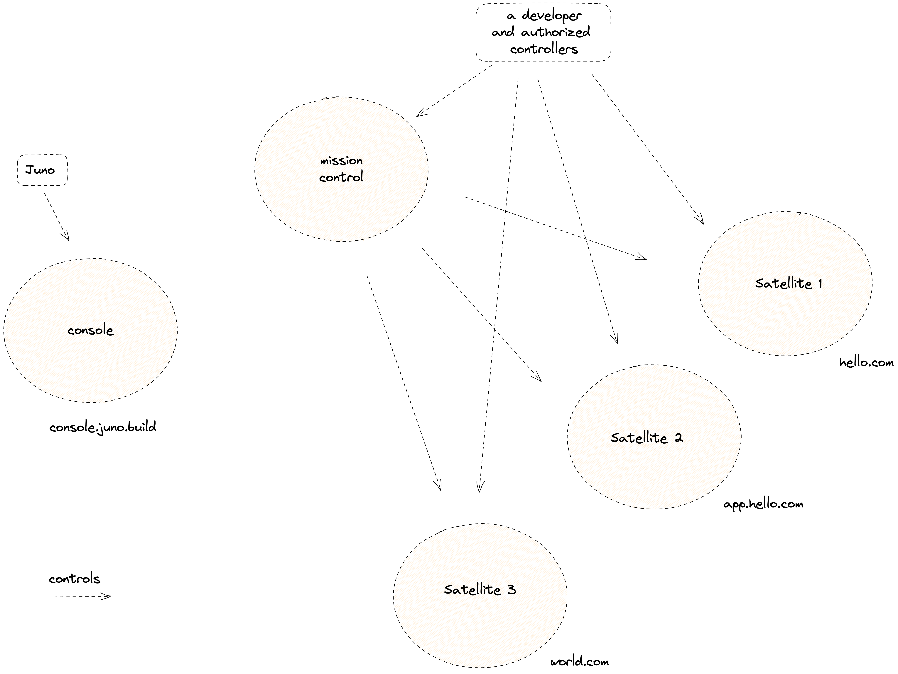
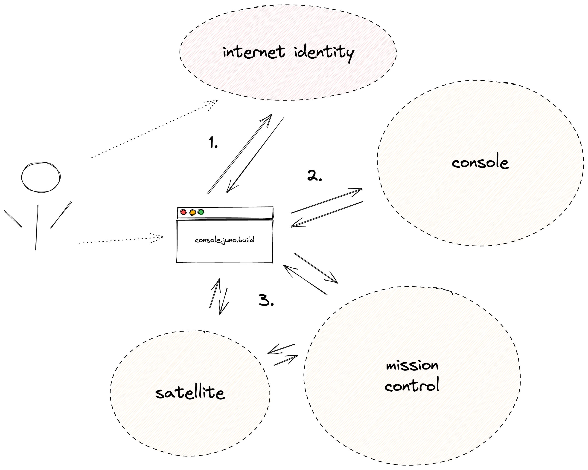
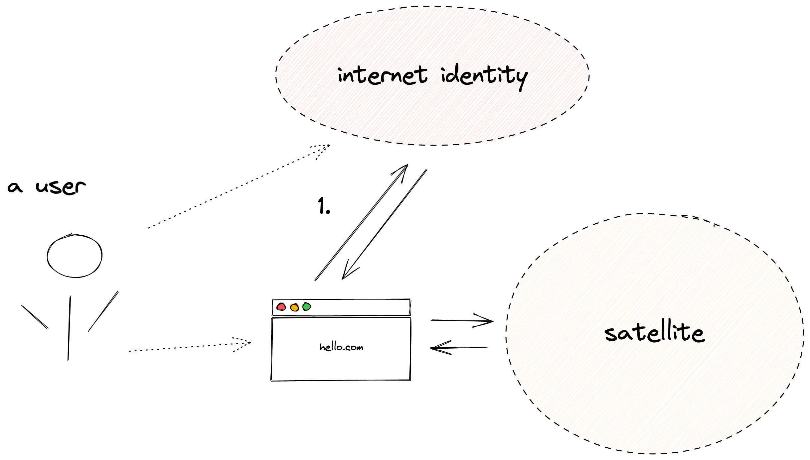

# Architecture

The architecture of Juno is designed to give developers complete control over their data.

This is achieved by creating a unique smart contract, known as a [mission control], for each developer. This smart contract is exclusively controlled by the developer and Juno has no control, rights, or access to any of the developer's creations.

Every [satellite] created in Juno follows the same pattern, where it is owned by the developer and their authorized [controllers].

---

The permission and ownership structure of Juno is made possible through our [infrastructure], which is powered by the [Internet Computer](https://internetcomputer.org/).

When a developer signs into Juno's [console](https://console.juno.build) using [Internet Identity] (1), the console backend retrieves the developer's [mission control] (2). This information is then sent back to the developer's browser, where they can manage their [mission control] and [satellite] (3).

---

A [satellite] is a smart contract deployed on the [Internet Computer](https://internetcomputer.org), compiled into WebAssembly (WASM) code.

It contains stable memory, permission checks, and other Juno abstractions that serve as endpoints that can be queried by developers and users.

---

Once deployed and accessible to your users, a [satellite] operates similarly to a typical web flow. Users can interact directly with it or make authorized calls once they have logged in. Although a satellite is a smart contract, its behavior is similar to a regular web application.

[mission control]: terminology.md#mission-control
[satellite]: terminology.md#satellite
[controllers]: terminology.md#controller
[infrastructure]: category/infrastructure
[Internet Identity]: https://internetcomputer.org/internet-identity
